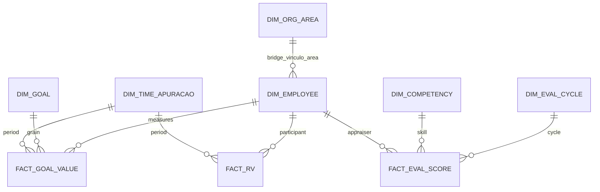

# Spec 1 — Descoberta dimensional (clientes Afya + Allos)

**Objetivo:** classificar as **616 tabelas** do contrato ERP (referência `MereoGR-Afya`) em papéis Snowflake-style e propor dims/fatos para o DW conformed.

**Gerado por:** `analytics/catalog/explore_client_dimensions.py`  
**Artefatos:** [`client_table_classification.csv`](../catalog/client_table_classification.csv), [`dim_fact_candidates.yaml`](../catalog/dim_fact_candidates.yaml)

---

## 1. Premissas

| Item | Valor |
|------|-------|
| Referência estrutural | `MereoGR-Afya` (616 tabelas, 803 FKs) |
| Clientes piloto | `afya`, `allos` (`tenant_slug` no CH) |
| **Não-cliente** | `MereoGR-Staging` — ver [Spec 2](staging-database-role-spec.md) |
| Contrato futuro | Todo `MereoGR-{Cliente}` replica as 616 tabelas |

---

## 2. Classificação dimensional (616 tabelas)

| Papel | Qtd | Descrição |
|-------|-----|-----------|
| **DIM** | 129 | Entidades descritivas (hubs FK, pessoa, área, meta, competência…) |
| **FACT** | 59 | Medidas/eventos (`CALC_*`, `VALOR_*`, respostas, scores…) |
| **BRIDGE** | 10 | Many-to-many (`COLABORADOR_AREA`, vínculos…) |
| **REF** | 11 | Lookups compartilhados (`unidade_medida`, `idioma`…) |
| **EXCLUDE** | 168 | Plataforma, audit, import, logs (ADR-006) |
| **DEFER** | 239 | Sem dados em Afya+Allos no backup piloto |

### População nos clientes

| Métrica | Valor |
|---------|-------|
| Tabelas com dados em **Afya e Allos** | 234 |
| Só Afya | 48 |
| Só Allos | 33 |
| Silver implementada (373) cobre | 372/616 ERP keys no catálogo |

---

## 3. Top 20 hubs FK → candidatos dim/fact

| Hub ERP | Grau FK | Papel | Silver |
|---------|---------|-------|--------|
| `dbo.COLABORADOR` | 164 | DIM | `colaborador.pessoa` |
| `dbo.META` | 30 | DIM | `metricas.meta` |
| `dbo.AREA` | 24 | DIM | `organizacao.area` |
| `competences.AVALIACAO` | 27 | DIM | `avaliacao.avaliacao_ciclo` |
| `dbo.SuccessionCycle` | 21 | DIM | `sucessao.succession_cycle` |
| `dbo.PERIODO_APURACAO` | 18 | DIM | `metricas.periodo_apuracao` |
| `dbo.PERIODO_GESTAO` | 18 | DIM | `metricas.periodo_gestao` |
| `competences.AVALIADO` | 15 | DIM | `avaliacao.avaliado` |
| `dbo.ACAO` | 14 | DIM/FACT | `acao.acao` |
| `dbo.INDICADOR` | 12 | DIM | `metricas.indicador` |
| `competences.COMPETENCIA` | 12 | DIM | `avaliacao.competencia` |
| `dbo.Training` | 11 | DIM | `pdi.training` |
| `dbo.FEEDBACK_CONTINUO` | 13 | FACT | `avaliacao.feedback_continuo` |

Lista completa: [`dim_fact_candidates.yaml`](../catalog/dim_fact_candidates.yaml)

---

## 4. Primeira onda dimensional (Snowflake naming)

### Dimensões conformed (G1)

| Nome alvo | Fonte silver | PK composta |
|-----------|--------------|-------------|
| `DIM_EMPLOYEE` | `colaborador.pessoa` | `(tenant_slug, id)` |
| `DIM_ORG_AREA` | `organizacao.area` | `(tenant_slug, id)` |
| `DIM_ORG_JOB` | `organizacao.cargo` | `(tenant_slug, id)` |
| `DIM_GOAL` | `metricas.meta` | `(tenant_slug, id)` |
| `DIM_KPI` | `metricas.indicador` | `(tenant_slug, id)` |
| `DIM_TIME_GESTAO` | `metricas.periodo_gestao` | `(tenant_slug, id)` |
| `DIM_TIME_APURACAO` | `metricas.periodo_apuracao` | `(tenant_slug, id)` |
| `DIM_EVAL_CYCLE` | `avaliacao.avaliacao_ciclo` | `(tenant_slug, id)` |
| `DIM_COMPETENCY` | `avaliacao.competencia` | `(tenant_slug, id)` |

### Fatos prioritários (G2) — grains propostos

| Nome alvo | Fontes silver | Grain |
|-----------|---------------|-------|
| `FACT_GOAL_VALUE` | `metricas.valor_meta`, `metricas.nota_meta`, `metricas.meta` | `tenant_slug, id_meta, id_periodo_apuracao` |
| `FACT_RV` | `remuneracao.participante_rv` | `tenant_slug, id` |
| `FACT_EVAL_SCORE` | `avaliacao.calc_resultado_*`, `avaliacao.resposta` | `tenant_slug, id_avaliador, id_competencia` (varia por tabela) |
| `FACT_MATRIX_CELL` | `metricas.valor_matriz` | `tenant_slug, fk_matriz, fk_membro_dimensao1/2, dt_ref` |
| `FACT_ACTION` | `acao.acao`, `acao.reuniao` | `tenant_slug, id` |
| `FACT_FEEDBACK` | `avaliacao.feedback_continuo` | `tenant_slug, id` |

---

## 5. ERD dimensional v0



---

## 6. 21 tabelas obrigatórias no contrato cliente (ausentes em Staging)

Módulo Goal/KPI + views de fila — **devem existir** em Afya/Allos e clientes futuros:

`Goal`, `GoalResponsible`, `GoalValue`, `KPI`, `KPIBreakdown`, `KPIGrouping`, `ManagementCycle`, `Breakdown`, `BreakdownValue`, `BreakdownValueOption`, `BrfGoalSyncLog`, `VW_*` (9 views).

---

## 7. Regenerar

```bash
uv run python -m mereo_tools drift --group mereogr --reference-db MereoGR-Afya --detailed
uv run python analytics/catalog/explore_client_dimensions.py --clients afya,allos
```

---

## 8. Critérios de aceite

- [x] 616 linhas classificadas (`client_table_classification.csv`)
- [x] 21 tabelas ausentes em Staging documentadas
- [x] Top 20 hubs FK mapeados
- [x] ≥5 fatos com grain explícito
