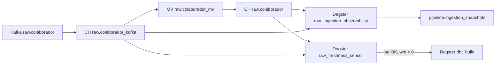

# Mapeamento Dagster ↔ ingestão ClickHouse (wave 1)

Referência rápida para `colaborador`. Template completo: [`entity-pipeline-spec.md`](entity-pipeline-spec.md). Catálogo: [`pilot.yaml`](../catalog/pilot.yaml).

## Fluxo



## Matriz wave 1 — `colaborador`

| Papel | Componente | Identificador |
|-------|------------|---------------|
| Consumo Kafka no CH | Kafka Engine | `raw.colaborador_kafka` |
| Consumer group | `SETTINGS kafka_group_name` | `ch-raw-colaborador-v2` |
| Tabela destino raw | ReplacingMergeTree | `raw.colaborador` |
| MV | Materialized View | `raw.colaborador_mv` |
| Lag (sensor + observability) | `system.kafka_consumers` | `WHERE table = 'colaborador_kafka'` |
| Watermark | query | `SELECT max(_ts_ms) FROM raw.colaborador` |
| Volume ingerido | Job + schedule 5 min | `raw_ingestion_observability` |
| Persistência volume | INSERT | `pipeline.ingestion_snapshots` |
| Watermark / lag ops | INSERT | `pipeline.entity_watermarks`, `pipeline.consumer_lag_snapshots` |
| Gating dbt | Sensor 120s | `raw_freshness_sensor` → `dbt_build` |
| Bloqueio | INSERT | `pipeline.freshness_events` (`dbt_blocked=1`) |

## Env vars (cluster)

| Variável | Valor wave 1 |
|----------|----------------|
| `MEREPO_PILOT_ENTITY` | `colaborador` |
| `CH_RAW_CONSUMER_GROUP` | `ch-raw-colaborador-v2` |
| `CH_HOST` | `clickhouse-mereo-clickhouse` (in-cluster) |
| `CH_PORT` | `8123` |
| `FRESHNESS_MAX_LAG` | `100` |

Deployment: [`k8s/mereo/12-deployment-analytics-code.yaml`](../../k8s/mereo/12-deployment-analytics-code.yaml).

## Queries do job observability

```sql
SELECT count() FROM raw.colaborador;
SELECT count() FROM raw.colaborador FINAL;
SELECT tenant_slug, count() FROM raw.colaborador GROUP BY tenant_slug;
SELECT coalesce(max(_ts_ms), 0) FROM raw.colaborador;
-- lag: system.kafka_consumers WHERE table = 'colaborador_kafka'
```

Código: [`analytics/dagster/mereo_analytics/definitions.py`](../dagster/mereo_analytics/definitions.py).

## Wave 2+

- Uma linha por entidade em `pilot.yaml` → `entities[]`
- `kafka_table` = `{entity}_kafka`
- `consumer_group` = `ch-raw-{entity}-v2` (nunca reutilizar)
- Parametrizar `PILOT_ENTITY` / loop no job observability
