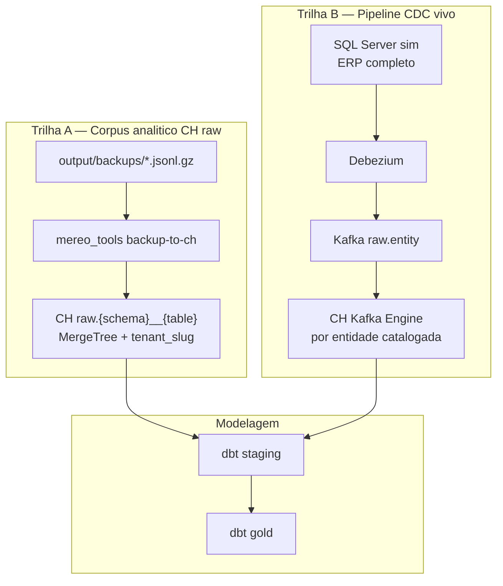

# Spec — ERP completo em ClickHouse `raw` (modelagem dbt)

**Objetivo:** ter **todos os dados de negócio** dos 3 bancos piloto disponíveis em `raw.*` no ClickHouse para desenhar e testar modelos dbt — **sem depender só de `dbo.COLABORADOR`**.

**Não é o mesmo que wave 1:** wave 1 valida o **pipeline CDC** (Debezium → Kafka → CH) com uma entidade. Este documento cobre o **corpus analítico** no CH.

---

## Por que o plano anterior parou em `COLABORADOR`

| Decisão anterior | Motivo na época | Impacto |
|------------------|----------------|---------|
| Restore só `dbo.COLABORADOR` no SQL sim | Destravar CDC / validate em horas | ERP incompleto no SQL |
| Spec wave 1 = 1 entidade no Kafka/CH | Padrão operacional (1 tópico, 1 consumer group, 1 MV) | CH com ~2,8k linhas em `raw.colaborador`, não ~22k |
| “Não clonar o ERP no sim” | Evitar 595 tabelas × port-forward | Modelagem sem joins reais no CH |

**Mal-entendido:** “subir o banco no SQL” + “raw no CH para modelar” foi lido como **só a entidade piloto do catálogo**, não como **todas as tabelas com dados do backup**.

---

## O que já temos (ativos)

| Ativo | Conteúdo |
|-------|----------|
| `output/backups/MereoGR-*` | Schema + dados (Staging ~5,9M linhas; Allos ~1,4M; Afya ~2,6M; TOP 50k em tabelas grandes) |
| SQL sim `mereo-sqlserver` | `COLABORADOR` completo + CDC; **resto do ERP ainda não restaurado** |
| Pipeline CDC | 3 connectors `colaborador` Ready; CH `raw.colaborador` **parcial** vs SQL |
| Ferramentas | `restore-local` (bulk insert), `backup-local`, Dagster observability |

---

## Arquitetura alvo (duas trilhas)



### Trilha A (prioridade para modelagem) — **bulk backup → CH**

Carga **inicial e completa** a partir de `output/backups/`, sem um Kafka topic por tabela.

| Decisão | Escolha |
|---------|---------|
| Fonte | Arquivos `data/{schema}__{table}.jsonl.gz` já no disco |
| Destino CH | Database `raw`, tabela `raw.{schema}__{table}` (snake, multi-tenant) |
| Colunas fixas | `tenant_slug String` + colunas espelhando SQL (tipos CH inferidos do backup/schema) |
| Engine | `MergeTree` — `ORDER BY (tenant_slug, …pk…)` se PK conhecida; senão `ORDER BY (tenant_slug, cityHash64(*))` |
| Dedup CDC | `_ts_ms UInt64 DEFAULT 0`, `_deleted UInt8 DEFAULT 0` (placeholder para alinhar com RMT depois) |
| Tabelas vazias no backup | Pular (só schema opcional via DDL estático) |
| Tabelas sem PK | Ingerir mesmo assim (snapshot); documentar em catálogo |

**Por que não CDC para tudo agora:** ~1.800 tabelas × (Kafka topic + CH Kafka Engine + MV + connector config) = inviável na POC. ~81% com PK ainda são **centenas** de conectores/tópicos.

### Trilha B (paralela) — **SQL sim completo + CDC por catálogo**

| Passo | Ação |
|-------|------|
| B1 | `restore-local` **sem** `--tables` — ERP inteiro no `mereo-sqlserver` (usar bulk insert; `--skip-schema` só em resume) |
| B2 | CDC: habilitar em **todas as tabelas com PK** usadas na trilha A (script em lote, não só `COLABORADOR`) |
| B3 | Debezium: expandir por **ondas** no catálogo (`pilot.yaml` entities), não 600 de uma vez |
| B4 | Re-snapshot / reset consumer CH para `colaborador` alinhar ~22k linhas |

Trilha B alimenta **freshness** e produção; trilha A alimenta **modelagem agora**.

---

## Escopo de dados (backup)

| Banco | Tabelas c/ arquivo | Tabelas c/ linhas (manifest) | Linhas totais (aprox.) |
|-------|-------------------|------------------------------|-------------------------|
| MereoGR-Staging | 595 | 21 | 5.895.040 |
| MereoGR-Allos | 616 | 197 | 1.431.630 |
| MereoGR-Afya | 616 | 282 | 2.558.850 |

**Incluir:** todas as tabelas com `data/*.jsonl.gz` não vazio.  
**Excluir opcional (config):** padrões `AUDIT_*`, `LOG_*`, `HangFire.*` — só se quiserem raw “limpo”; default **incluir** para modelagem fiel.

---

## Contrato de tabela CH `raw`

### Naming

| SQL Server | ClickHouse |
|------------|------------|
| `dbo.COLABORADOR` | `raw.dbo__colaborador` |
| `competences.COMPETENCIA` | `raw.competences__competencia` |

### Multi-tenant

Todas as linhas dos 3 bancos na **mesma tabela CH**, coluna `tenant_slug` (`afya` | `staging` | `allos`) — igual ao CDC.

### dbt

Gerar/atualizar `analytics/dbt/models/staging/_raw__sources.yml` via script a partir do inventário:

```yaml
sources:
  - name: raw
    tables:
      - name: dbo__colaborador
      - name: dbo__meta
      # ...
```

Models `stg_*` criados **sob demanda** quando a modelagem precisar (não gerar 500 models de uma vez).

### Dagster

| Job | Função |
|-----|--------|
| `raw_ingestion_observability` | Generalizar: loop entidades **ou** snapshot de `system.tables` em `raw` (contagem por tabela) |
| `raw_freshness_sensor` | Mantém gating por entidade catalogada (CDC); não bloqueia modelagem em tabelas só bulk |

---

## Implementação (fases)

### Fase 0 — Spec e catálogo (este doc)

- [ ] Aprovar trilha A como caminho para “todo ERP no CH”
- [ ] Atualizar `analytics/catalog/pilot.yaml` → `wave: erp-raw-bulk`
- [ ] Marcar wave 1 CDC como subconjunto (`colaborador`)

### Fase 1 — Ferramenta `backup-to-ch` (novo)

Novo módulo `mereo_tools/backup_to_ch.py`:

1. Lê `output/backups/{db}/manifest.json` + `data/*.jsonl.gz`
2. Para cada tabela com dados: inferir DDL CH (schema SQL em `schema/schema.sql` ou inventário)
3. `CREATE TABLE IF NOT EXISTS raw.{schema}__{table}`
4. Insert em batch (reutilizar coerce + chunk pymssql limits adaptados para CH `insert`)
5. CLI: `uv run python -m mereo_tools backup-to-ch --databases MereoGR-Staging,MereoGR-Allos,MereoGR-Afya`

**Multi-tenant:** o 1º banco da lista faz `DROP` da tabela; os demais fazem `DELETE WHERE tenant_slug=…` antes do insert. Recarga completa: apague `output/backups/MereoGR-*/ch_load_progress.json` e rode **sem** `--resume`.

**Ordem:** Staging → Allos → Afya (ou paralelo por banco se memória permitir).

### Fase 2 — SQL sim ERP completo

```bash
MSSQL_HOST=127.0.0.1 MSSQL_PORT=11434 uv run python -m mereo_tools restore-local \
  --databases MereoGR-Staging,MereoGR-Allos,MereoGR-Afya \
  --enable-cdc --skip-drop --resume
```

Primeira vez sem `--skip-schema` se bancos vazios; resumes com `--skip-schema`.

### Fase 3 — Alinhar CDC `colaborador`

- Re-snapshot Debezium (restart connectors após SQL cheio)
- Validar `raw.colaborador` ≈ soma SQL por tenant
- Decidir: manter duas cópias (`raw.dbo__colaborador` bulk vs `raw.colaborador` CDC) ou convergir depois

### Fase 4 — dbt discovery

- Script `analytics/catalog/generate_raw_sources.py` → `_raw__sources.yml`
- Documentar joins candidatos (FK do `schema.sql`)
- Modelagem gold **depois**, tabela a tabela

### Fase 5 — CDC ondas (opcional, pós-modelagem)

Para entidades que precisem **stream** em prod: adicionar em `pilot.yaml`, gerar connector + CH Kafka Engine a partir do template em `entity-pipeline-spec.md`.

---

## Critérios de aceite — ERP raw no CH

| # | Critério |
|---|----------|
| 1 | `SELECT count() FROM system.tables WHERE database='raw'` ≥ **nonempty_tables** somados dos 3 bancos (menos exclusões explícitas) |
| 2 | Por banco piloto: `sum(rows)` em CH por `tenant_slug` dentro de ±1% do manifest backup (tabelas grandes amostradas: validar TOP 50k explícito) |
| 3 | `dbo.COLABORADOR`: Afya/Allos/Staging no CH com mesma ordem de grandeza do SQL sim |
| 4 | Dagster `raw_ingestion_observability` reporta volume por tabela (top N + total) |
| 5 | `_raw__sources.yml` gerado e `dbt parse` OK |

---

## O que **não** faz parte desta spec

- Gold / métricas de negócio finais
- Flink / Wasabi Tier 3
- Re-backup de produção (usar `output/backups` existente)
- 600 Kafka topics + 600 Debezium connectors de uma vez

---

## Referências

- Template CDC por entidade: [`entity-pipeline-spec.md`](entity-pipeline-spec.md)
- Aceite pipeline CDC wave 1: [`wave-1-acceptance.md`](wave-1-acceptance.md)
- Inventário: `mereo_tools inventory` → `output/groups/mereogr/`
- Backup: `output/backups/summary.json`
