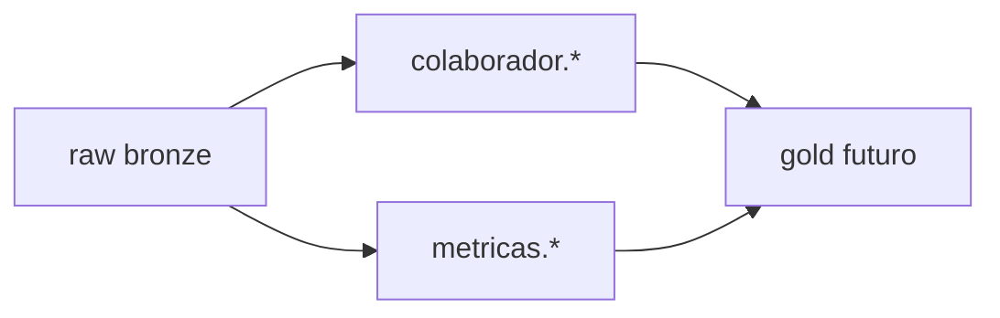

# Medallion ETL — Bronze / Prata / Ouro

Arquitetura de camadas para modelagem dbt sobre o ERP MereoGR multi-tenant.

## Mapeamento de camadas

| Camada | Database CH | Papel | dbt |
|--------|-------------|-------|-----|
| **Bronze** | `raw` | Ingestão (bulk + CDC) | `source('bronze', …)` |
| **Silver** | `{dominio}` | Domínios de negócio | `models/silver/{dominio}/` |
| **Gold** | `gold` | Marts (fase 2) | `models/gold/` |

Silver **não** usa database único `silver` nem schema `dbo` — ver [`silver-modeling-guide.md`](silver-modeling-guide.md).

## Convenção de nomes

| Camada | Exemplo |
|--------|---------|
| Bronze | `raw.dbo__META` |
| Silver | `metricas.meta`, `colaborador.pessoa` |
| Gold | `gold.gl_colaborador_by_grupo` (legado) |

**ADRs:** [`silver-architecture-decisions.md`](silver-architecture-decisions.md)

## Fluxo



## Estrutura dbt

```
models/
  bronze/_bronze__sources.yml
  silver/
    colaborador/pessoa.sql
    metricas/meta.sql
  gold/
```

## Geradores

```bash
uv run python analytics/catalog/generate_raw_sources.py
uv run python analytics/catalog/generate_silver_model.py --domain metricas --table meta
```

## Build

```bash
dbt build --select silver.colaborador.* silver.metricas.*
```

Gold fora de escopo até silver estável — ADR-011.
