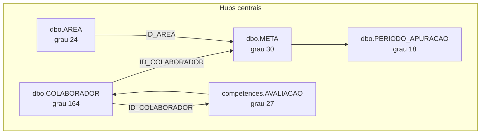

# Spec — Descoberta de domínios silver (bronze → relacionamentos → domínios)

**Objetivo:** inventariar as 486 tabelas bronze, mapear relacionamentos (FKs + heurísticas), propor domínios candidatos com evidência, e **só depois** expandir ETL silver.

**Artefatos gerados:**

| Artefato | Caminho |
|----------|---------|
| Mapa máquina (486 tabelas) | [`bronze_domain_map.yaml`](../catalog/bronze_domain_map.yaml) |
| Grafo de relacionamentos | [`bronze_relationship_graph.json`](../catalog/bronze_relationship_graph.json) |
| Resumo CSV | [`bronze_domain_summary.csv`](../catalog/bronze_domain_summary.csv) |
| Grafo FK bruto (803 FKs) | `output/groups/mereogr/schema/foreign_keys.json` |
| Catálogo silver atual | [`silver_domains.yaml`](../catalog/silver_domains.yaml) |
| Script de análise | [`analyze_bronze_domains.py`](../catalog/analyze_bronze_domains.py) |
| Sync catálogo silver | [`sync_silver_catalog.py`](../catalog/sync_silver_catalog.py) |
| Codegen silver batch | [`generate_silver_batch.py`](../catalog/generate_silver_batch.py) |
| Exploração dimensional | [`client-dimensional-discovery-spec.md`](client-dimensional-discovery-spec.md) |
| Papel Staging | [`staging-database-role-spec.md`](staging-database-role-spec.md) |
| Reuso silver → gold | [`silver-to-dimensional-reuse-spec.md`](silver-to-dimensional-reuse-spec.md) |
| Export FK | `uv run python -m mereo_tools export-fk-graph` |

**Regenerar análise:**

```bash
uv run python -m mereo_tools export-fk-graph --group mereogr --source backup --patch-ddl
analytics/dagster/.venv/bin/python analytics/catalog/analyze_bronze_domains.py
```

---

## 1. Escopo e premissas

- **Bronze:** database CH `raw` — naming `{schema}__{TABLE}` (ex.: `dbo__COLABORADOR`)
- **Multi-tenant:** coluna `tenant_slug` (staging, allos, afya) em todas as tabelas
- **Referência estrutural:** `MereoGR-Afya` — 803 FKs, 616 tabelas ERP
- **Silver atual:** **373 views** em **9 domínios CH** (100% das 373 tabelas bronze de negócio — ADR-015)
- **ADRs:** [`silver-architecture-decisions.md`](silver-architecture-decisions.md)

Exclusões silver (ADR-006): `AUDIT_*`, `IMP_*`, `LOG_*`, `HangFire`, `AbpEntity*` — classificadas mas **não modeladas**.

---

## 2. Inventário bronze (486 tabelas)

### Por schema ERP

| Schema ERP | Tabelas bronze | Exemplo |
|------------|----------------|---------|
| `dbo` | ~414 | `dbo__META`, `dbo__COLABORADOR` |
| `competences` | 40 | `competences__AVALIADO` |
| `HangFire` | 8 | jobs background |
| `audit`, `auth`, `cache`, `core`, `dashboards`, `notification`, `Tasks` | ~24 | plataforma |
| `okr` | 8 | `okr__Objective` |
| `stg` | 4 | views materializadas |
| CDC | 1 | `colaborador` (sem prefixo `schema__`) |

**Volume total:** ~11,66M linhas nos 3 tenants (bulk CH).

### Resumo por domínio candidato (business silver — 373/373)

| Domínio | Tabelas | Linhas | % volume | Silver implementada |
|---------|---------|--------|----------|---------------------|
| **metricas** | 86 | 6.335.448 | 54,3% | **86** |
| **avaliacao** | 78 | 1.145.707 | 9,8% | **78** |
| **colaborador** | 78 | 333.844 | 2,9% | **78** |
| **organizacao** | 29 | 240.857 | 2,1% | **29** |
| **acao** | 26 | 72.904 | 0,6% | **26** |
| **sucessao** | 26 | 1.632 | 0,0% | **26** |
| **pdi** | 22 | 23.069 | 0,2% | **22** |
| **referencia** | 14 | 653 | 0,0% | **14** |
| **remuneracao** | 14 | 303.329 | 2,6% | **14** |
| audit | 27 | 1.181.788 | 10,1% | — (excluído) |
| plataforma | 50 | 869.228 | 7,5% | — (excluído) |
| import | 22 | 885.323 | 7,6% | — (excluído) |
| logs | 8 | 246.472 | 2,1% | — (excluído) |
| views_stg | 4 | 2.218 | 0,0% | — (excluído) |
| config | 2 | 24.099 | 0,2% | — (excluído) |

**Nota volume:** `metricas` concentra 54,3% das linhas — `metricas.valor_matriz` (~5,9M rows staging) com **view filtrada** por vars dbt (ADR-015; guard `1=0` sem filtro `DtRef`).

**Automação:** `sync_silver_catalog.py` + `generate_silver_batch.py` → catálogo + models; `dbt run --select silver.*` validado no cluster.

---

## 3. Grafo de relacionamentos

### Fonte

- **803 FKs** extraídas de `output/backups/MereoGR-Afya/schema/schema.sql`
- Export: `foreign_keys.json` com hubs ranqueados por grau de conectividade
- **244 arestas cross-domain** entre domínios de negócio no grafo bronze

### Top 15 hubs (entidades centrais)

| Grau | Hub ERP | Domínio provável |
|------|---------|------------------|
| 164 | `dbo.COLABORADOR` | colaborador |
| 30 | `dbo.META` | metricas |
| 27 | `competences.AVALIACAO` | avaliacao |
| 24 | `dbo.AREA` | organizacao |
| 21 | `dbo.SuccessionCycle` | sucessao |
| 18 | `competences.FORMULARIO_AVALIACAO` | avaliacao |
| 18 | `dbo.PERIODO_APURACAO` | metricas |
| 17 | `dbo.PERIODO_GESTAO` | metricas |
| 15 | `competences.AVALIADO` | avaliacao |
| 14 | `competences.FUNCAO` | avaliacao |
| 14 | `dbo.ACAO` | acao |
| 13 | `dbo.AVALIADO_SUCESSAO` | sucessao |
| 13 | `dbo.FEEDBACK_CONTINUO` | feedback |
| 12 | `competences.COMPETENCIA` | avaliacao |
| 12 | `dbo.INDICADOR` | metricas |



### Arestas cross-domain mais frequentes

| FKs | De → Para |
|-----|-----------|
| 23 | colaborador → metricas |
| 23 | avaliacao → metricas |
| 18 | metricas → colaborador |
| 16 | avaliacao → colaborador |
| 16 | colaborador → avaliacao |
| 13 | acao → colaborador |
| 13 | colaborador → organizacao |
| 12 | organizacao → colaborador |
| 10 | organizacao → metricas |
| 10 | colaborador → sucessao |
| 10 | avaliacao → sucessao |

**Interpretação:** `colaborador` é o hub universal; `metricas` e `avaliacao` são os segundo e terceiro polos. Domínios periféricos (`acao`, `feedback`, `sucessao`, `okr`) conectam-se via esses hubs — joins gold cruzarão domínios, não precisam fundir silver.

---

## 4. Catálogo de hubs e colunas de ligação

### Hubs → colunas FK típicas

| Hub | Colunas incoming | Domínio CH |
|-----|------------------|------------|
| `dbo.COLABORADOR` | `ID_COLABORADOR`, `ID_COLABORADOR_AVALIADO`, `EmployeeId` | `colaborador` |
| `dbo.AREA` | `ID_AREA` | `organizacao` |
| `dbo.CARGO` | `ID_CARGO` | `organizacao` |
| `dbo.META` | `ID_META` | `metricas` |
| `dbo.INDICADOR` | `ID_INDICADOR` | `metricas` |
| `dbo.PERIODO_GESTAO` | `ID_PERIODO_GESTAO` | `metricas` |
| `dbo.PERIODO_APURACAO` | `ID_PERIODO_APURACAO` | `metricas` / `remuneracao` |
| `competences.AVALIACAO` | `ID_AVALIACAO` | `avaliacao` |
| `competences.AVALIADO` | `ID_AVALIADO` | `avaliacao` |
| `dbo.PARTICIPANTE_RV` | — (fato RV) | `remuneracao` |

### Relacionamentos silver já implementados

| De | Coluna | Para |
|----|--------|------|
| `colaborador.vinculo_area` | `id_colaborador` | `colaborador.pessoa` |
| `colaborador.vinculo_area` | `id_area` | `organizacao.area` |
| `metricas.meta` | `id_indicador` | `metricas.indicador` |
| `metricas.meta` | `id_area` | `organizacao.area` |
| `metricas.valor_meta` / `nota_meta` | `id_meta` | `metricas.meta` |
| `remuneracao.participante_rv` | `id_periodo_apuracao` | `metricas.periodo_apuracao` |
| `remuneracao.participante_rv` | `id_colaborador` | `colaborador.pessoa` |
| `avaliacao.avaliador` | `id_avaliado` | `avaliacao.avaliado` |
| `avaliacao.avaliado` | `id_colaborador_avaliado` | `colaborador.pessoa` |

---

## 5. Domínios candidatos (proposta para workshop)

### 5.1 Domínios de negócio — modelar na silver

#### `colaborador` (109 tabelas, 386k rows)

Pessoas, perfil, histórico de vínculos, dados de RH estendidos.

**Hubs:** `COLABORADOR`, `COLABORADOR_AREA`, `HISTORICO_*`  
**Exemplos bronze:** `dbo__COLABORADOR`, `dbo__PSW_COLABORADOR`, `dbo__Education`, `dbo__EmployeeAnalyticResult`  
**Silver hoje:** `pessoa`, `vinculo_area`, `historico_area`, `historico_cargo`, `pessoa_cdc`

#### `organizacao` (29 tabelas, 241k rows)

Estrutura hierárquica, cargos, filiais, grupos.

**Hubs:** `AREA`, `CARGO`, `FILIAL`, `GRUPO_USUARIO`  
**Exemplos:** `dbo__AREA`, `dbo__JobPositionLevel`, `dbo__AreasGroup`  
**Silver hoje:** `area`, `cargo`, `grupo_usuario`, `filial`, `perfil_area`

#### `metricas` (75 tabelas, 6,37M rows)

Metas, indicadores, apuração, matrizes, faróis, curvas, strategy goals.

**Hubs:** `META`, `INDICADOR`, `PERIODO_GESTAO`, `PERIODO_APURACAO`, `ValorMatriz`  
**Exemplos:** `dbo__META`, `dbo__VALOR_META`, `dbo__GoalWorkflow`, `dbo__TriggerArea`  
**Silver hoje:** 7 entidades (meta, indicador, valor_meta, nota_meta, expressao_calculo, periodo_gestao, periodo_apuracao)  
**Volume crítico:** `ValorMatriz` — onda 5 separada (ADR-010)

#### `avaliacao` (66 tabelas, 1,14M rows)

Performance, competências, nine-box, calibração.

**Hubs:** `competences.AVALIACAO`, `AVALIADO`, `AVALIADOR`, `COMPETENCIA`  
**Regra ADR-008:** schema ERP `competences.*` → CH database `avaliacao`  
**Silver hoje:** `avaliado`, `avaliador` — falta `resposta` e ~38 tabelas `competences__*`

#### `remuneracao` (14 tabelas, 303k rows)

RV, extratos, modificadores, adiantamentos.

**Hub:** `PARTICIPANTE_RV` → `PERIODO_APURACAO` + `COLABORADOR`  
**Exemplos:** `dbo__ParticipantExtract`, `dbo__Modifier`, `dbo__ScoreValuesRV`  
**Silver hoje:** `participante_rv`

#### `referencia` (14 tabelas, 653 rows)

Dimensões compartilhadas entre domínios.

**Exemplos:** `dbo__UNIDADE_MEDIDA`, `dbo__GRANDEZA`, `dbo__IDIOMA`, `dbo__Locality`  
**Silver hoje:** `unidade_medida`

### 5.2 Domínios candidatos — decisão pendente

| ID | Tabelas | Hubs | Questão para workshop |
|----|---------|------|----------------------|
| **acao** | 16 | `ACAO`, `REUNIAO` | Domínio CH separado ou subconjunto de `metricas`? (14 FKs para COLABORADOR, ligação com metas via BOOK) |
| **feedback** | 9 | `FEEDBACK_CONTINUO` | Domínio próprio ou extensão de `avaliacao`/`colaborador`? |
| **sucessao** | 23 | `SuccessionCycle` | Domínio próprio ou extensão de `avaliacao`? (21 FKs no hub) |
| **pdi** | 10 | `Training*`, PDI | Domínio próprio ou `colaborador`? |
| **okr** | 6 | `okr.Objective` | Domínio próprio ou subconjunto de `metricas`? |
| **estrategia** | 2 | `StrategyCycle` | Fundir em `metricas`? |

### 5.3 Fora de escopo silver (classificados, não modelar)

| Bucket | Tabelas | Linhas | Motivo |
|--------|---------|--------|--------|
| import | 22 | 885k | staging `IMP_*` |
| audit | 27 | 1,18M | `AUDIT_*` |
| logs | 8 | 246k | `LOG_*` |
| plataforma | 50 | 869k | HangFire, Abp, cache, UI |
| views_stg | 4 | 2k | views `stg.*` |
| config | 2 | 24k | config residual (revisar manualmente) |

---

## 6. Fronteiras ambíguas (quantificado)

### Ação ↔ Métricas

- `dbo.ACAO` tem grau 14 no grafo FK
- Tabelas limítrofes: `dbo__BOOK`, `dbo__METABOOK`, `dbo__GoalWorkflow*`, `dbo__MARCADOR_ACAO*`
- **Proposta inicial:** domínio `acao` separado; joins com `metricas.meta` na gold via `ID_META` quando existir

### OKR ↔ Métricas

- 6 tabelas `okr.*` — sem FK direta para `dbo.META` na maioria
- Semântica paralela (Objective ≈ meta estratégica)
- **Proposta inicial:** domínio `okr` separado até validar overlap com clientes

### Sucessão ↔ Avaliação

- 23 tabelas, hub `SuccessionCycle` (grau 21)
- 10 FKs cross-domain `avaliacao → sucessao` e `colaborador → sucessao`
- **Proposta inicial:** domínio `sucessao` separado (ciclo de negócio distinto)

### BOOK / Presentation

- Classificadas em `metricas` (BOOK) ou `plataforma` (Presentation*)
- Artefatos de conteúdo/UI — prioridade baixa para silver

---

## 7. Cobertura silver atual vs gap

| Domínio | Total bronze | Implementado | Gap |
|---------|--------------|--------------|-----|
| colaborador | 109 | 5 | 104 |
| metricas | 75 | 7 | 68 |
| avaliacao | 66 | 2 | 64 |
| organizacao | 29 | 5 | 24 |
| remuneracao | 14 | 1 | 13 |
| referencia | 14 | 1 | 13 |
| acao | 16 | 0 | 16 |
| sucessao | 23 | 0 | 23 |
| feedback | 9 | 0 | 9 |
| pdi | 10 | 0 | 10 |
| okr | 6 | 0 | 6 |

**Total negócio modelável:** ~386 tabelas (excluindo import/audit/logs/plataforma/stg)  
**Implementado:** 21 (~5,4% do escopo negócio)

---

## 8. Ondas ETL sugeridas (após aprovação de domínios)

| Onda | Domínio | Prioridade | Notas |
|------|---------|------------|-------|
| 1 | colaborador + organizacao | Alta | núcleo — em progresso |
| 2 | metricas (core) | Alta | meta, indicador, valor, nota, periodos — feito |
| 3 | avaliacao (competences) | Alta | 40 tabelas competences |
| 4 | remuneracao | Média | RV + extratos |
| 5 | metricas (volume) | Baixa | ValorMatriz 5,9M — ADR-010 |
| 6 | acao + feedback | Média | após decisão de domínio |
| 7 | sucessao + pdi | Baixa | ciclos específicos |
| 8 | okr + estrategia | Baixa | módulos opcionais |

**Regra:** cada onda exige entrada em `silver_domains.yaml` + ADR se novo domínio CH.

---

## 9. Decisões de domínio — workshop (fechadas)

Ver **ADR-013** em [`silver-architecture-decisions.md`](silver-architecture-decisions.md).

| ID | Decisão | Status |
|----|---------|--------|
| **D1** | `acao` — **CH database separado** | Fechado |
| **D2** | `feedback` — **dentro de `avaliacao`** | Fechado |
| **D3** | `sucessao` — **CH database separado** | Fechado |
| **D5** | `okr` — **dentro de `metricas`** (tabelas `objetivo_okr`, `resultado_chave`, …) | Fechado — ver análise abaixo |
| **D9** | **9 CH databases silver** | Fechado |

### Análise OKR → `metricas` (recomendação aceita)

| Critério | OKR `okr.*` | `dbo.META` / indicadores |
|----------|-------------|-------------------------|
| FKs estruturais | 14 arestas, grafo **fechado** em `okr.*` | Hub `META` grau 30 |
| FK para META/INDICADOR/AREA | **Nenhuma** | N/A |
| FK para COLABORADOR | `EmployeeKeyResult`, `KeyResultValue` | via `ID_RESPONSAVEL` etc. |
| FK para referência | `KeyResult` → `UNIDADE_MEDIDA` | `INDICADOR` → unidade |
| Volume bronze | 532 rows (8 tabelas) | 89k+ em META |
| Naming | `Id`, camelCase (módulo novo) | `ID`, UPPER (legado) |

**Conclusão:** OKR é módulo de **gestão de objetivos** alinhado semanticamente a métricas, mas **isolado no ERP**. Manter no CH database `metricas` evita 10º namespace sem ganho estrutural; silver usa prefixo `*_okr` para não confundir com `meta`/`indicador` legado. Joins com `dbo.META` ficam na **gold** por regra de negócio (período, área), não por FK.

### Fechadas em ADR-014

| ID | Decisão |
|----|---------|
| **D4** | **CH database `pdi`** — Training, Qualification, HISTORICO_PDI, competences PDI |
| **D6** | **Estratégia fundida em `metricas`** |
| **D8** | **ValorMatriz** = fato de células da matriz (não VALOR_META) — onda 5, volume pendente |

### Ainda em aberto

- [ ] **D7:** `BOOK` / `Presentation*` — silver ou só gold?
- [ ] **D10:** Ordem de ondas após domínios fechados

### Silver `avaliacao` — onda 3 (12/78 tabelas)

| View CH | Bronze | Rows |
|---------|--------|------|
| `avaliacao_ciclo` | competences.AVALIACAO | 327 |
| `avaliado` / `avaliador` | competences.* | 33k / 84k |
| `competencia` | competences.COMPETENCIA | 2,2k |
| `formulario_avaliacao` | competences.FORMULARIO_AVALIACAO | 82k |
| `funcao` | competences.FUNCAO | — |
| `resposta` | competences.RESPOSTA_AVALIACAO | 105k |
| `feedback_continuo` + pulse/timeline/notificacao | dbo.FEEDBACK_* | 473 + 12k |

**Próximo na avaliacao:** tabelas `CALC_RESULTADO_*` (~500k rows), `COMENTARIO_COMPETENCIA`, `FATOR_AVALIACAO`, `NINE_BOX*`.

---

## 10. Próximos passos (pós-workshop)

1. Fechar decisões D1–D10
2. Atualizar [`silver_domains.yaml`](../catalog/silver_domains.yaml) com todas as entidades (`implemented` / `planned` / `excluded`)
3. Novos ADRs para domínios aprovados
4. `CREATE DATABASE` em [`07-clickhouse-init-sql.yaml`](../../k8s/mereo/07-clickhouse-init-sql.yaml)
5. Scaffold ETL: `analytics/dagster/.venv/bin/python analytics/catalog/generate_silver_model.py --wave N`
6. `dbt run --select silver.*` via Dagster

---

## Apêndice A — Metodologia de classificação

Ordem de precedência em `analyze_bronze_domains.py`:

1. Padrões de exclusão (`AUDIT_`, `IMP_`, …)
2. Entrada manual em `silver_domains.yaml`
3. Grafo FK → hub → domínio
4. Colunas `ID_*` inferidas
5. Padrões de nome / schema ERP (`competences` → avaliacao, `okr` → okr)
6. Fallback `config` para resíduos

Confiança: `manual` > `fk` > `inferred` > `prefix` > `fallback`

## Apêndice B — Drift multi-tenant

- Drift report: `output/groups/mereogr/schema/drift_report.json` — 125 diffs entre 14 bancos amostra
- Antes de incluir entidade no catálogo silver: validar colunas comuns nos 3 pilotos (Afya, Staging, Allos)
