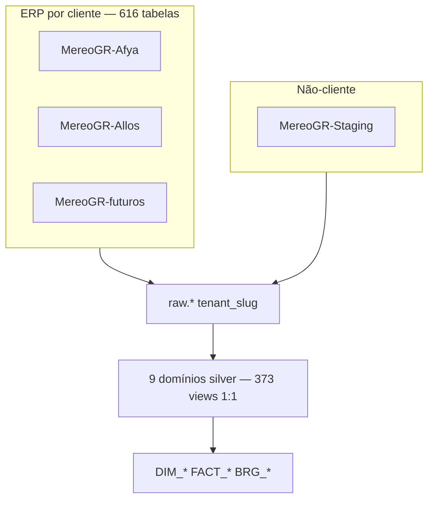

# Guia de modelagem — Silver por domínios

Silver = camada **prata** (ODS conformed) entre bronze (`raw.*`) e **gold dimensional** (dims/fatos Snowflake-style).

**ADRs:** [`silver-architecture-decisions.md`](silver-architecture-decisions.md)  
**Catálogo:** [`silver_domains.yaml`](../catalog/silver_domains.yaml)  
**Specs de exploração:**
- [client-dimensional-discovery-spec.md](client-dimensional-discovery-spec.md) — 616 tabelas → DIM/FACT
- [staging-database-role-spec.md](staging-database-role-spec.md) — papel do Staging
- [silver-to-dimensional-reuse-spec.md](silver-to-dimensional-reuse-spec.md) — reuso das 373 views

---

## Modelo alvo (Snowflake-style)



| Camada | Papel | Qtd referência |
|--------|-------|----------------|
| Bronze | Landing multi-tenant | 486 tbl CH |
| Silver | ODS normalizado 1:1 | 373 views |
| Gold | Dims + fatos conformed | 616+ derivadas |

**Contrato:** cada cliente `MereoGR-*` replica **616 tabelas** (schema Afya). O DW modela **uma vez**; escala via `tenant_slug`.

---

## Tenants

| Banco SQL | `tenant_slug` | Papel |
|-----------|---------------|-------|
| MereoGR-Afya | `afya` | **Cliente** (referência estrutural) |
| MereoGR-Allos | `allos` | **Cliente** |
| MereoGR-Staging | `staging` | **Interno Mereo** — ver ADR-016; fora de marts |

---

## Domínios (CH databases)

| Domínio | Exemplos | Candidato dimensional |
|---------|----------|----------------------|
| `colaborador` | `pessoa`, `vinculo_area` | `DIM_EMPLOYEE`, bridges |
| `organizacao` | `area`, `cargo` | `DIM_ORG_*` |
| `metricas` | `meta`, `indicador`, `valor_meta` | `DIM_GOAL`, `FACT_GOAL_VALUE` |
| `avaliacao` | `avaliado`, `calc_resultado_*` | `DIM_EVAL_*`, `FACT_EVAL_SCORE` |
| `remuneracao` | `participante_rv` | `FACT_RV` |
| `referencia` | `unidade_medida` | `REF_*` |
| `acao` | `acao`, `reuniao` | `FACT_ACTION` |
| `sucessao` | `succession_cycle` | dims sucessão |
| `pdi` | `training` | dims PDI |

---

## Contrato ETL silver (cada `.sql`)

1. `source('bronze', '{bronze_table}')`
2. `tenant_slug` preservado
3. Colunas UPPER → snake_case
4. `where _deleted = 0` quando existir
5. Sem agregação — joins cross-domain só na **gold**

---

## Tooling

```bash
# Classificação dimensional (clientes)
uv run python analytics/catalog/explore_client_dimensions.py --clients afya,allos

# Papel do Staging
uv run python analytics/catalog/explore_staging_role.py

# Reuso silver → gold
uv run python analytics/catalog/audit_silver_reuse.py

# Scaffold / batch
uv run python analytics/catalog/generate_silver_batch.py --domain metricas
```

---

## Build

```bash
cd analytics/dbt
dbt build --select silver.*
./analytics/scripts/dbt-via-dagster.sh
```

---

## Gold dimensional (G1 + G2 implementado)

Ver [gold-dimensional-wave-g1-g2.md](gold-dimensional-wave-g1-g2.md) — 9 `dim_*` + 6 `fact_*` em `gold.*`, filtro `production_tenant_slugs` (afya, allos).

```bash
dbt build --select 'gold.dim.* gold.fact.*'
```

**G3:** marts cross-domain em `gold.mart_*` — ver [gold-dimensional-wave-g3.md](gold-dimensional-wave-g3.md).
