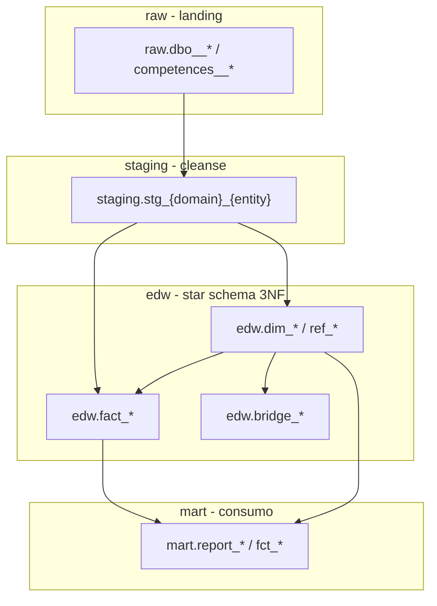
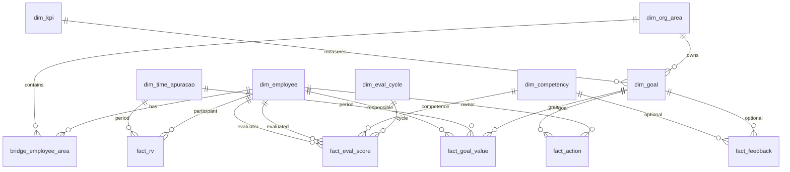

# Data Model: Snowflake dimensional Mereo

**Feature**: 001-snowflake-dbml-model  
**Spec**: [spec.md](spec.md)

## Visão geral — quatro zonas

**Regra inviolável**: `edw.*` nunca declara `@origen: raw.*`.

---

## Nomenclatura

### Schemas lógicos e `@layer`

| Schema | `@layer` | Função | Exemplo qualificado |
|--------|----------|--------|---------------------|
| `raw` | `raw` | Landing CDC/bulk, espelho ERP | `raw.dbo__COLABORADOR` |
| `staging` | `staging` | Tipagem, rename, joins intra-domínio | `staging.stg_colaborador_colaborador` |
| `edw` | `edw` | Star schema conformed | `edw.dim_employee` |
| `mart` | `mart` | Agregados e reports | `mart.report_performance_360` |

### `@group` (LocalDrawDB TableGroup)

| `@group` | Conteúdo |
|----------|----------|
| `ingestao_{dominio}` | Tabelas raw por domínio (`colaborador`, `metricas`, `avaliacao`, …) |
| `exclude` | EXCLUDE — plataforma, audit, HangFire |
| `staging` | Todas `staging.stg_*` |
| `dimensional` | `edw.dim_*` |
| `fatos` | `edw.fact_*` |
| `bridge` | `edw.bridge_*` |
| `ref` | `edw.ref_*` |
| `agregados` | `mart.fct_*` intermediários |
| `reports` | `mart.report_*` |

### Objetos EDW

| Tipo | Padrão | Exemplo |
|------|--------|---------|
| Dimensão | `edw.dim_{entity}` snake_case EN | `edw.dim_employee` |
| Fato | `edw.fact_{process}` | `edw.fact_goal_value` |
| Bridge | `edw.bridge_{a}_{b}` | `edw.bridge_employee_area` |
| Referência | `edw.ref_{lookup}` | `edw.ref_unit_of_measure` |
| Staging | `staging.stg_{domain}_{table}` | `staging.stg_metricas_meta` |
| Mart report | `mart.report_{name}` | `mart.report_performance_360` |
| Mart agregado | `mart.fct_{metric}` | `mart.fct_goal_attainment_daily` |
| DEFER stub | `edw.defer_{table}` | `edw.defer_imp_colaborador` |

### Chaves

| Tipo | Padrão | Uso |
|------|--------|-----|
| Surrogate | `{entity}_key BIGINT` | PK interna EDW, joins entre dims/fatos |
| Natural | `{entity}_id` (tipo ERP) | Business key |
| Multi-tenant | `tenant_slug STRING` | Grain em STAGING/EDW/MART; valores: `afya`, `allos`, `staging` |
| Grain composto | `(tenant_slug, …)` | Documentado em `@note` do fato |

**SCD**: SCD Type 1 default para dims conformed (sem histórico ERP nesta fase). Históricos (`dbo.HISTORICO_*`) modelados como fatos ou dims snapshot em feature futura.

### Metadados LocalDrawDB (obrigatórios)

| Tag | Onde | Exemplo |
|-----|------|---------|
| `@layer` | Acima `CREATE TABLE` | `-- @layer: edw` |
| `@group` | Acima `CREATE TABLE` | `-- @group: dimensional` |
| `@note` | Acima `CREATE TABLE` | `-- @note: SCD1 colaborador` |
| `@fk` | Acima `CREATE TABLE` | `-- @fk: area_id -> edw.dim_org_area.area_id` |
| `@origen` | Acima `CREATE TABLE` | `-- @origen: staging.stg_colaborador_colaborador` |
| `@map` | Inline na coluna | `employee_id BIGINT, -- @map <- staging.stg_....employee_id` |

Fan-in: `@origen: raw.tabela_a, raw.tabela_b` permitido **apenas** em STAGING.

---

## ERD — hubs colaborador × metricas × avaliacao

---

## Grains prioritários (EDW)

| Objeto EDW | Fonte raw principal | Grain |
|------------|---------------------|-------|
| `edw.dim_employee` | `raw.dbo__COLABORADOR` | `(tenant_slug, employee_id)` |
| `edw.dim_org_area` | `raw.dbo__AREA` | `(tenant_slug, area_id)` |
| `edw.dim_goal` | `raw.dbo__META` | `(tenant_slug, goal_id)` |
| `edw.bridge_employee_area` | `raw.dbo__COLABORADOR_AREA` | `(tenant_slug, employee_id, area_id)` |
| `edw.fact_goal_value` | `raw.dbo__VALOR_META` | `(tenant_slug, goal_id, dt_ref)` |
| `edw.fact_eval_score` | `raw.competences__CALC_RESULTADO_AVALIADOR_COMPETENCIA` | `(tenant_slug, score_id)` |
| `edw.fact_rv` | `raw.dbo__PARTICIPANTE_RV` | `(tenant_slug, participant_id)` |
| `edw.fact_feedback` | `raw.dbo__FEEDBACK_CONTINUO` | `(tenant_slug, feedback_id)` |
| `edw.fact_action` | `raw.dbo__ACAO` | `(tenant_slug, action_id)` |

---

## Matriz 616 tabelas

Arquivo: [contracts/erp_mapping_matrix.csv](contracts/erp_mapping_matrix.csv)

Colunas:

| Coluna | Descrição |
|--------|-----------|
| `erp_key` | Chave ERP `schema.TABLE` |
| `bronze_table` | Nome CH `dbo__*` |
| `dimensional_role` | DIM/FACT/BRIDGE/REF/EXCLUDE/DEFER |
| `layer_path` | `raw`, `raw+staging+edw`, `raw+edw_stub` |
| `raw_object` | `raw.{bronze}` |
| `staging_object` | `staging.stg_*` |
| `edw_object` | `edw.dim_*` / stub / vazio |
| `mart_object` | Downstream opcional |
| `localdrawdb_layer` | Valor `@layer` |
| `localdrawdb_group` | Valor `@group` |
| `note` | Documentação |

---

## Marts alvo (consumo)

| Mart | Fontes EDW | Propósito |
|------|--------------|-----------|
| `mart.report_performance_360` | dim_employee, fact_goal_value, fact_eval_score, dim_goal | Performance integrada |
| `mart.report_goal_by_area` | dim_org_area, fact_goal_value, dim_goal | Metas por área |
| `mart.fct_goal_attainment_daily` | fact_goal_value, dim_time_gestao | Agregado diário |

Marts de produção filtram `tenant_slug IN ('afya','allos')` (ADR-016).

---

## Migração vs modelo atual

| Atual (CH) | Modelo alvo lógico |
|------------|-------------------|
| `raw.*` | `raw.*` (mantém) |
| `colaborador.*`, `metricas.*`, … (silver) | **Descontinuado** → `staging` + `edw` |
| `gold.dim_*`, `gold.fact_*`, `gold.mart_*` | **Realocado** → `edw` + `mart` |

Implementação física (novos databases CH ou views) = feature posterior a aprovação DBML.
